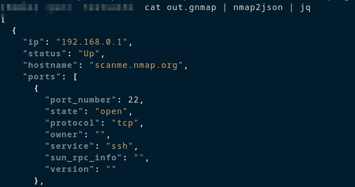
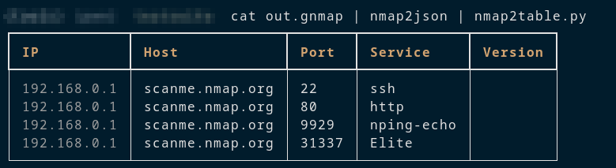
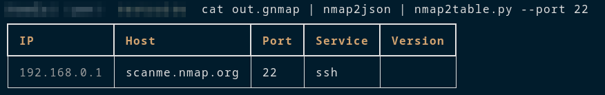

# nmap2json

A helper script to convert grepable nmap files (.gnmap) into json files.
Good in combination with nmap2table.

## Usage

```sh
# gnmap file as argument:
nmap2json path/to/scan.gnmap

# via stdin
cat path/to/scan.gnmap | nmap2json
```

**Formatted Example Output:**




## Working with the json file

As nicely formatted table:

```sh
cat scan.gnmap | nmap2json | nmap2table
```




The output can also be filtered by port/service:


```sh
cat scan.gnmap | nmap2json | nmap2table --port 22
cat scan.gnmap | nmap2json | nmap2table --serivce ssh
```



If only the IPs are required for certain services (e.g. for other scans):

```sh
cat scan.gnmap | nmap2json | nmap2table --port 22 --ip-only
```


